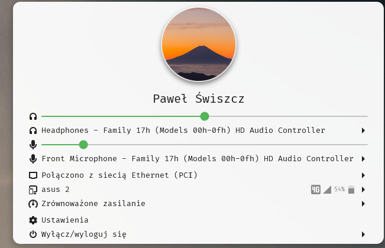
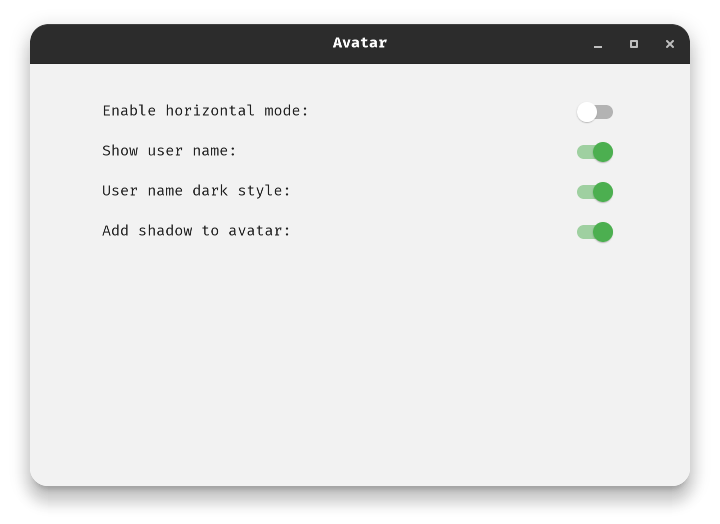

# Avatar-Gnome-Shell-Extension

Adds an avatar to the top panel. Suports Gnome 41

Horizontal and vertical Orientation can be set in options

It was based on https://github.com/GustavoPeredo/Big-Avatar-Gnome-Shell-Extension

# Screens

More screens in <a href="https://github.com/pawelswiszcz/Avatar-Gnome-Shell-Extension/tree/master/assets">assets</a> directory