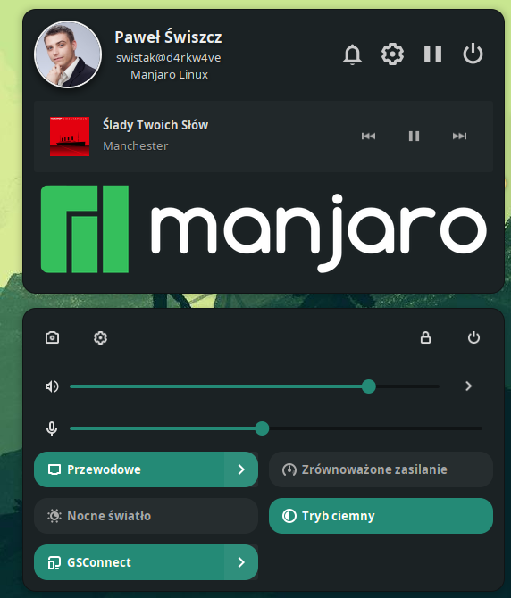

# Avatar-Gnome-Shell-Extension

Adds an avatar, primary system buttons, mpris media notifications and top image to the top panel.  Supports Gnome 45, 46, 47, 48

Available on gnome EGO:

# Changelog
### v 29
- Fixed frezing image picker

### v 26 
- Gnome 45 support
- Drop shell support lower than 45. If You are using gnome shell < 44 use https://github.com/pawelswiszcz/Avatar-Gnome-Shell-Extension/tree/gnome-loe-44 branch
  
### v 25 
- Gnome 44 support

### v 24 
- Fixed menu is not defined

### v 23
- Fixed order of elements
- Added Detached mode, show avatar box on the top and outline class
- Refactoring
- Drop shell support lower than 43. If You are using gnome shell < 43 use https://github.com/pawelswiszcz/Avatar-Gnome-Shell-Extension/tree/gnome-loe-43 branch

### v 22
- Fixed destroying `mediaSectionMenuItem`

### v 21
- Fixed buttons style for gnome 43. Fixed Mpris `reactive` background

### v 20
- Fixed Mpris media. Using vanilla implementation instead of `Me.imports.src.MediaSection`;

# Screenshots

### Notes

Extension was based on [Big Avatar](https://extensions.gnome.org/extension/3488/big-avatar/) 
Code used https://github.com/qwreey75/quick-settings-tweaks