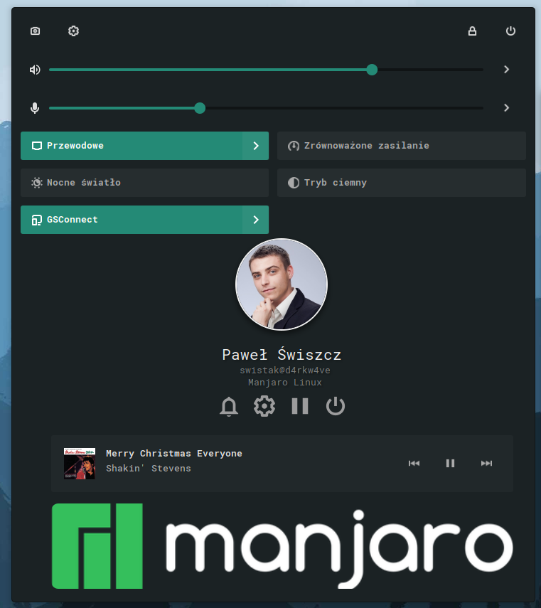

# Avatar-Gnome-Shell-Extension

Adds an avatar, primary system buttons, mpris media notifications and top image to the top panel.  Supports Gnome 41, 42 and 43

Available on gnome EGO:

# Changelog

### v 22
- Fixed destroying `mediaSectionMenuItem`

### v 21
- Fixed buttons style for gnome 43. Fixed Mpris `reactive` background

### v 20
- Fixed Mpris media. Using vanilla implementation instead of `Me.imports.src.MediaSection`;

# Screenshots

### Notes

Extension was based on [Big Avatar](https://extensions.gnome.org/extension/3488/big-avatar/) 
 
