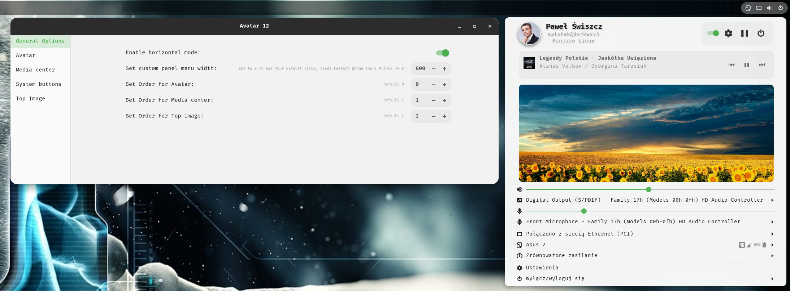

# Avatar-Gnome-Shell-Extension

Adds an avatar, primary system buttons, mpris media notifications and top image to the top panel.  Supports Gnome 41, 42 and 43

Available on gnome EGO:

# Changelog

### v 20
- Fixed Mpris media. Using vanilla implementation instead of `Me.imports.src.MediaSection`;

### v 19
- Added Gnome 43 support, Thanks [@bitseater](https://github.com/bitseater '@bitseater') for testing

### v 18

- Added ability to change the missing notification icon (disabled option is also changeable)
- MediaSection and MediaList to other components to be more customizable 

### v 17

- Added ability to change the Avatar icon size
- Preferences window more compact

### v 16

- Fix signal menuOpenHandlerId disconnect from menu.

### v 15

- Fix for Mpris section container is visible even if no Media is playing. [@Zetta1Reid0](https://github.com/Zetta1Reid0 '@Zetta1Reid0')

### v 14

- Adding a notification icon instead of a Switch in primary buttons [@Zetta1Reid0](https://github.com/Zetta1Reid0 '@Zetta1Reid0') 
### v 13

- Added new section Top image
- Added the ability to reorder Avatar, Media center, Top image sections
- Fix default mpris notifications not showing when extensions' mpris is enabled and extension is disabled

### v 12

- Refactor UserWidget

- Changed Preferences window to more modern

### v 11

- Removed Mpris Media center from calendar popup [@Zetta1Reid0](https://github.com/Zetta1Reid0 '@Zetta1Reid0') 

### v 10

- Added Gnome 42 support [@isteiger](https://github.com/isteiger '@isteiger') 

# Screenshots

